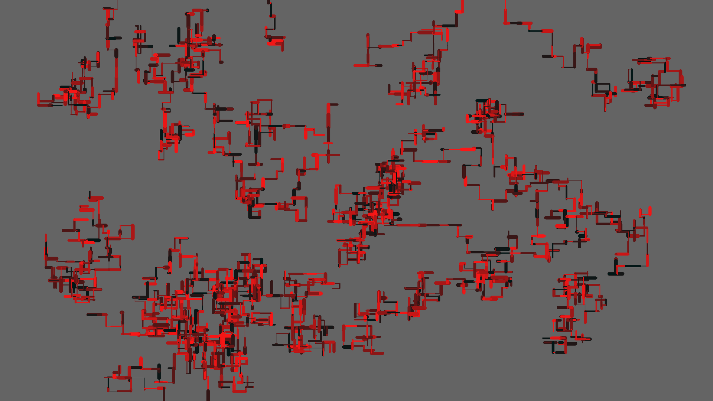

# Welcome to Zack Wellborn's Programming Portfolio

## Programming 1 Semester 1 Projects:

### OOP Calculator
Graphic based OOP calculator. 

[Source Code](https://github.com/ZackWellborn/A2ProgrammingPortfolio/tree/main/src/Calculator)

### Space Game

Epic Space Game where you play as a space ship and shoot asteroids!

[Source Code](https://github.com/ZackWellborn/A2ProgrammingPortfolio/tree/main/src/SpaceGame)

### Screen Saver

Basic Screen Saver App based off of Microsoft Pipes. 

[Source Code](https://github.com/ZackWellborn/A2ProgrammingPortfolio/tree/main/src/ScreenSaver)

## Programming 2 Semester 2 Projects:

### ShapeTester

Epic Shape tester that gives surface area and volume calculations for spheres, cubes, and rectangular pyramids. 

[Source Code](https://github.com/ZackWellborn/A2ProgrammingPortfolio/tree/main/src/ShapeTester)

### Pig Latin Translater
A program that translates any given word directly into Pig Latin. 

[Source Code](https://github.com/ZackWellborn/A2ProgrammingPortfolio/tree/main/src/PigLatinConverter)

